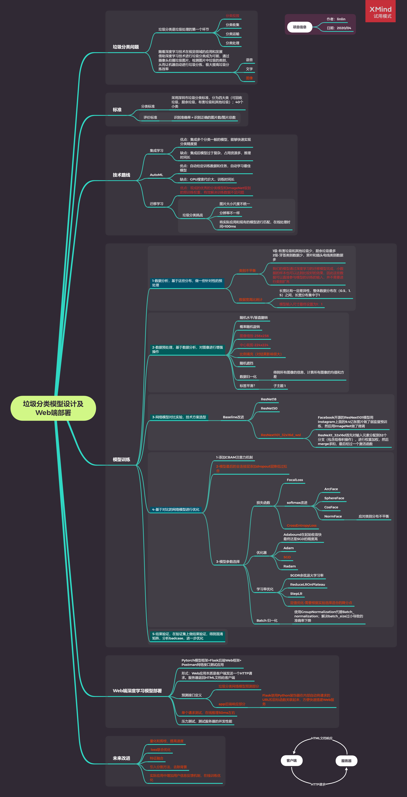

# Garbage_Classification



## Description

1 https://www.bilibili.com/video/BV1gz41187Hk

2 https://www.bilibili.com/video/BV11C4y1p7rT

3 https://www.bilibili.com/video/BV1b64y1T7T9

4 https://www.bilibili.com/video/BV1sC4y1x7Pc

5 https://www.bilibili.com/video/BV1SC4y1p7F2

6 https://www.bilibili.com/video/BV1ZC4y1s7N2

7 https://www.bilibili.com/video/BV1MT4y1V74w

## Tree
```
.
├── bin
│   ├── app_test.py
│   ├── demo.py
│   ├── my_test.py
│   └── my_train.py
├── data
├── gcnet
│   ├── classifier.py
│   ├── __init__.py
│   ├── json_utils.py
│   ├── logger.py
│   ├── __pycache__
│   ├── resnet.py
│   ├── test.py
│   ├── train.py
│   ├── transforms.py
│   └── utils.py
├── models
└── preprocess
    ├── 01.html
    ├── 01-原始数据集分布可视化分析.py
    ├── 02-原始数据集train-val划分.py
    ├── 03.html
    ├── 03-train和val数据分布可视化.py
    ├── 04.html
    ├── 04-四大类垃圾分布可视化.py
    ├── 05.html
    ├── 05-四大类垃圾train-val分布可视化.py
    ├── 06-数据增强transform.py
    ├── 07-原始数据可视化.py
    ├── 08-预处理数据加载.py
    ├── 09-测试resnext101模型.py
    ├── 10-Web服务环境搭建.py
    ├── 11-分类网络环境搭建.py
    └── images
```

## Demo

```
python ./demo.py
```
## Train
```
You should download data and models from BaiduYun: https://pan.baidu.com/s/1g9RoIGxf2OD1zo4bgbMQWg password: cdz5

python ./my_train.py

```

## Test
```
python ./my_test.py
```

## Web

```
python ./app_test.py
```


## Experiment

|Model	|Iter|precision| recall	 |f1-score |
|---------|--------|-----|---------|-----------|
|resnext101_32x16d|10|0.9827|0.9826|0.9826|
|resnext101_32x8d|30|0.9589|0.9588|0.9583|
|resnext101_32x8d|10|0.9473|0.9472|0.9472|
|resnet18|10|0.8968|0.8959|0.8940|

- resnext101_32x16d

|LR	     |epoch|Train Loss|	Valid Loss|Train Acc. |	Valid Acc.|
|---------|--------|-----|---------|-----------|---------|
|0.001000|1.000000|0.281912|0.241702|90.296428|91.276075|
|0.001000|2.000000|0.177333|0.147571|93.530952|94.628832|
|0.001000|3.000000|0.163498|0.135344|94.181235|95.118656|
|0.001000|4.000000|0.148997|0.081726|94.586606|96.968161|
|0.001000|5.000000|0.133063|0.090255|95.110210|96.807702|
|0.001000|6.000000|0.125995|0.069795|95.346677|97.415759|
|0.001000|7.000000|0.122259|0.102625|95.642260|96.351659|
|0.001000|8.000000|0.127478|0.068116|95.422684|97.660671|
|0.001000|9.000000|0.132976|0.053337|95.312896|98.268727|
|0.001000|10.000000|0.118554|0.068123|95.616924|97.669116|

## 
